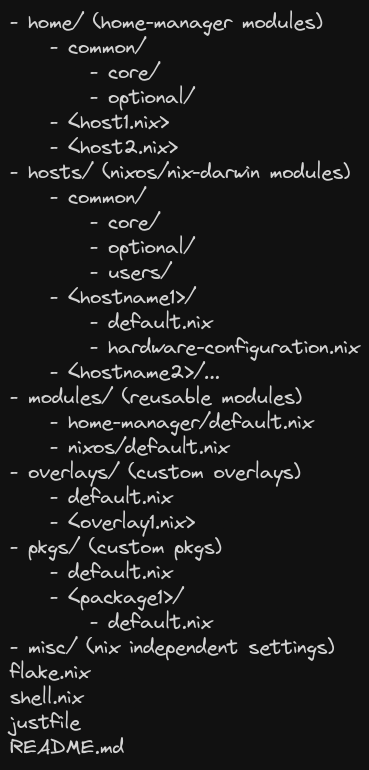

<!-- markdownlint-disable -->
<h1 align="center">
    <a name="top" title="nixos-config">
        nixos-config v3
    </a>
</h1>
<div align="center">
    <sup>
        <a href="https://nixos.org"></a>
    </sup>
        <br/>
        <sub>
            <a href="https://nixos.org/manual/nix/stable/language/index.html" target="_blank">
            
            </a>
            <a href="https://nixos.wiki/wiki/Flakes" target="_blank">
            
            </a>
            <a href="https://github.com/nix-community/home-manager" target="_blank">
            
            </a>
        </sub>
    </div>
</div>

<div align="center">
    Dotfiles for my <a href="https://github.com/YaLTeR/niri">Niri WM</a> setup on my <a href="https://nixos.org">NixOS</a> system.
    <br/>
    Includes my <a href="https://github.com/nix-community/home-manager" >Home Manager</a> configuration for linux and macos.
    <p><strong>Be sure to <a href="#" title="star">⭐️</a> or <a href="#" title="fork">🔱</a> this repo if you find it useful! 😃</strong></p>
</div>
<!-- markdownlint-restore -->

## Setup

- OS: [NixOS](https://nixos.org)
- Main window manager: [Niri](https://github.com/YaLTeR/niri)
- Secondary window manager: [Hyprland](https://hyprland.org)
- Status bar: [Waybar](https://github.com/Alexays/Waybar)
- Terminal: [Ghostty](https://ghostty.org) and [Kitty](https://sw.kovidgoyal.net/kitty/)
- Shell: `Zsh` with plugins managed through [antidote](https://github.com/mattmc3/antidote) with [oh-my-posh](https://ohmyposh.dev/) prompt
- Application launcher: [Walker](https://github.com/abenz1267/walker)
- Current theme: [Catppuccin](https://catppuccin.com/)
- Font: [Monaspace](https://github.com/githubnext/monaspace)
- Editor: [Neovim](https://neovim.io). Configuration can be found [here](https://github.com/dileep-kishore/nyanvim)

## Gallery

|             Desktop              |
| :------------------------------: |
|  |

|          Terminals + Zellij          |
| :----------------------------------: |
|  |

|             Neovim             |
| :----------------------------: |
|  |

|             VSCode             |
| :----------------------------: |
|  |

## Organization of the modules



## Installation

### Requirements

- NixOS 25.11 or Home-manager
- Patience
- Knowledge
- Disk space

### NixOS installation

Use `just bs` or:

```sh
sudo nixos-rebuild switch --flake '.#<host>'
```

### Home-manager installation

Use `just hs` or:

```sh
home-manager switch --flake '.#<user>@<host>'
```

### Manual setup

- [Zotero](https://www.zotero.org/)
  - Install the [zotero-dracula](https://github.com/dracula/zotero) if you see a white statusbar
  - Install the [zotero-better-bibtex](https://github.com/retorquere/zotero-better-bibtex) plugin

## Acknowledgements

- [EmergentMind's nix config](https://github.com/EmergentMind/nix-config): Structure, reference and some documentation
- [Misterio77's nix config](https://github.com/Misterio77/nix-config): Structure and reference
- [VimJoyer](https://github.com/vimjoyer): Whose YouTube videos aided me in beginning with Nix and persevering through challenges
