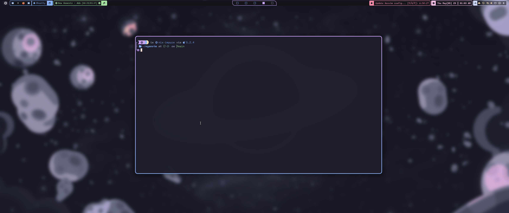
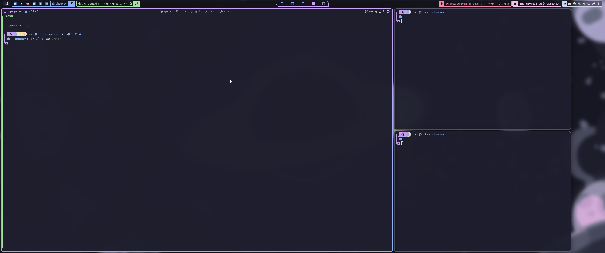
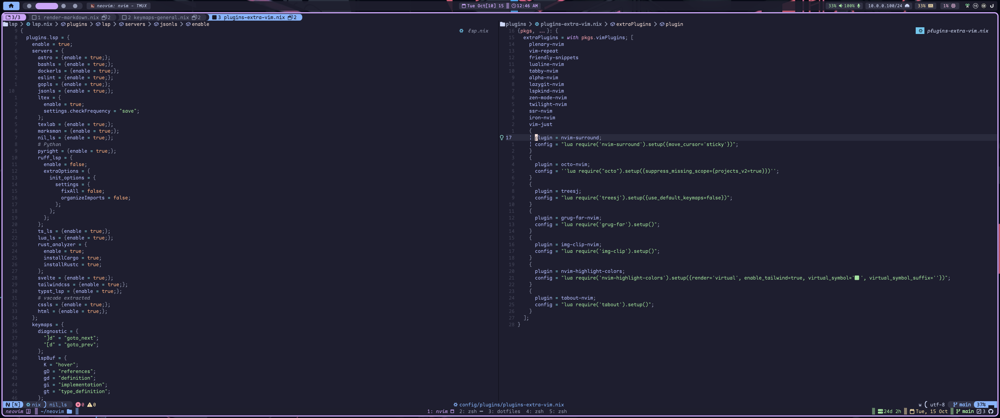
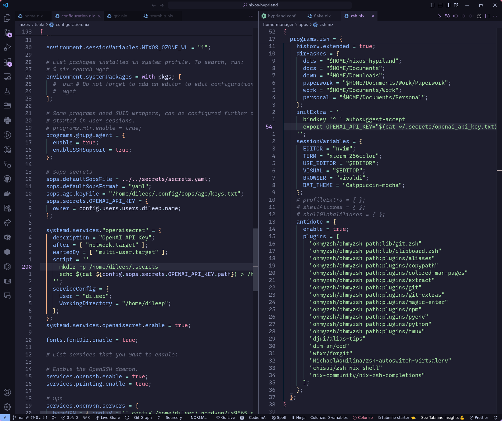

<!-- markdownlint-disable -->
<h1 align="center">
    <a name="top" title="nixos-hyprland">
        nixos-hyprland
    </a>
</h1>
    <br/>
    <br/>
    <br/>
<h1 align="center">
    <sup>
        <a href="https://nixos.org"></a>
    </sup>
        <br/>
        <sub>
            
            
        </sub>
    </sup>
</h1>

<div align="center">
    Dotfiles for my <a href="https://hyprland.org">Hyprland</a> setup on my <a href="https://nixos.org">NixOS</a> system.
    <p><strong>Be sure to <a href="#" title="star">⭐️</a> or <a href="#" title="fork">🔱</a> this repo if you find it useful! 😃</strong></p>
    <br/>
    
</div>
<!-- markdownlint-restore -->

## Setup

- OS: [NixOS](https://nixos.org)
- Window manager: [Hyprland](https://hyprland.org)
- Status bar: [Waybar](https://github.com/Alexays/Waybar)
- Terminal: [WezTerm](https://wezfurlong.org/wezterm/index.html)
- Shell: `Zsh` with plugins managed through [antidote](https://github.com/mattmc3/antidote)
- Current theme: [Catppuccin](https://github.com/catppuccin/catppuccin)
- Font: [Recursive](https://www.recursive.design)
- Editor: [Neovim](https://neovim.io). Configuration can be found [here](https://github.com/dileep-kishore/neovim)

## Gallery

|             Desktop              |
| :------------------------------: |
|  |

|           Terminal + Tmux            |
| :----------------------------------: |
|  |

|             Neovim             |
| :----------------------------: |
|  |

|            VSCode            |
| :--------------------------: |
|  |

## Installation

```sh
sudo nixos-rebuild switch --flake '.#tsuki'
```

